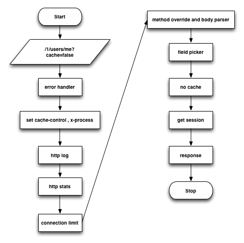

albi是基于koa的web开发框架，集成了常用的middleware，添加了statsD做系统统计，使用zipkin做服务追踪，更简单的mongodb操作与session的使用，简单构建node.js项目。

## Installation

```
git clone https://github.com/vicanso/albi.git
cd albi
npm install // 如果生产环境，使用npm install --production
node app.js // 配置文件从ectd中获取，如果需要指定etcd服务器的地址：ETCD=http://etcdServer:4001 node app.js
```

## middleware




### error handler

捕捉异常，对异常信息处理返回，暂只支持返回json。注：如果err.expose为true，表示主动抛出异常，否则表示未处理异常，输出的log会带上"EXCEPTION"关键字，便于事后查找代码完善处理。


### set Cache-Control，X-Process

所有http的响应头中的Cache-Control都设置为：must-revalidate, max-age=0，避免有http头未设置Cache-Control导致在某些缓存服务器（varnish）使用了默认的缓存时间来缓存。

X-Process先获取request header中的X-Process（由haproxy，nginx或varnish之类的添加），再加上当前node的标识添加到response header中。


### http log

记录http请求的相关信息，包括ip、url、状态码、请求时间等。注意最后的三个数字5-1032-1037，第一个数字表示当前请求接收到的时间，该进程还有多少个请求没有结束的，第二个数字表示当前请求的序号，第三个数字表示当前请求处理完成时，记录请求数的序号是多少。（即可以用第三个数字-第二个数字表示在这个请求处理的过程中，进来了多少个请求）

::1 "GET /1/users/me?cache=false HTTP/1.1" 304 0 9ms "" "Mozilla/5.0 (Macintosh; Intel Mac OS X 10_9_5) AppleWebKit/537.36 (KHTML, like Gecko) Chrome/42.0.2311.152 Safari/537.36" "_track:8241ae4d-b28e-4128-b6cb-6dc06458e487" 5-1032-1037


### connection limit

设置当如果正在处理的请求时超过多少之后，直接返回error


### file picker

当接口返回的数据比较多，可以只挑选需要用到的数据，减少传输的数据量

```
// data
{
  "name" : "my-name",
  "account" : "my-account",
  "address" : "",
  "phone" : ""
}

// GET /user?_fields=name,account

// return

{
  "name" : "my-name",
  "account" : "my-account"
}

```


### no cache

用于判断请求是否为no-cache的，主要为了方便varnish更快速的判断no cache的请求，做pass操作


### session

从redis中获取用户信息


## 目录结构

### controllers

响应http请求，调用相应的服务，获取数据之后，返回给浏览器，下面是获取用户信息的代码：


```
/**
 * [get 从session中获取用户信息]
 * @return {[type]} [description]
 */
function *get(){
  /*jshint validthis:true */
  let ctx = this;
  let sess = ctx.session;
  let result = sess.user || {
    anonymous : true,
    hashCode : uuid.v4()
  };
  // 用户跟踪cookie
  let track = ctx.cookies.get(config.trackKey);
  if (!track) {
    ctx.cookies.set(config.trackKey, uuid.v4(), {
      signed : false,
      maxAge : 365 * 24 * 3600 * 1000
    });
  }

  sess.user = result;
  yield Promise.resolve();
  ctx.body = pick(result);
}
```


### errors

定义的错误返回，有对应的出错code和message，如看下面的出错信息配置：


```
'use strict';
// 定义用户相关的出错信息 201-300

module.exports = {
  '201' : {
    cn : '该用户已存在。',
    en : 'the account is exists.'
  },
  '202' : {
    cn : '创建用户失败。',
    en : 'create account fail.'
  },
  '203' : {
    cn : '用户不存在。',
    en : 'account is not exist'
  },
  '204' : {
    cn : '登录失败，密码或用户名错误。',
    en : 'login fail, user or password is wrong'
  }
};

```


### helpers


### middlewares

koa的middleware，有http-stats，session，picker，可以增加更多的middleware


### models

mongodb的model定义，下面是user的定义


```
module.exports = {
  schema : {
    account : {
      type : String,
      required : true,
      unique : true
    },
    password : {
      type : String,
      required : true
    },
    name : {
      type : String,
      required : true,
      unique : true
    },
    createdAt : {
      type : String,
      required : true
    },
    lastLoginedAt : {
      type : String,
      required : true
    },
    loginTimes : {
      type : Number,
      'default' : 0
    }
  },
  // 索引数组
  indexes : [
    {
      account : 1
    },
    {
      account : 1,
      lastLoginedAt : 1
    }
  ]
};

```


### routes

路由配置文件，下面通过user的配置方式来详解一下：

```
{
  route : '/1/users/me',
  middleware : ['no-cache', 'session.get'],
  handler : 'user.get'
},
{
  route : '/1/users',
  middleware : 'session.get',
  method : 'post',
  handler : 'user.create'
},
{
  route : ['/1/login', '/1/user/login'],
  middleware : ['no-cache', 'session.get'],
  handler : 'user.login'
},
{
  route : '/1/logout',
  middleware : 'session.get',
  method : 'post',
  handler : 'user.logout'
}
```

- route：可以为String和Array，url的形式就是koa的方式

- middleware：可以为String或者Array，对应middlewares目录下的middleware方法

- method：可以为String或者Array，http的method，如果不配置，默认为get

- handler：String，对应controllers目录下的处理方法


## services

提供调用数据库之类的服务
